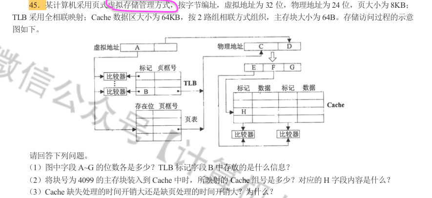

[TOC]

# 操作系统

# 真题

## 1 

- 

## 2
- 

## 3 最近分支记录(Last branch record)
- .png)
-
## 4
- .png)

## 5
 - .png)

## 6
 - .png)

# CPU

## 1.进程管理

## :star2: 考点：

#### (1)进程是什么

#### (2)多线程是什么

#### (3)进程调度

 - 考点：
   	- 调度算法
      	- （先到先服务）、（短作业优先）、（优先级）、（轮转）、（多级队列）、（多级反馈）

#### (4)同步

#### (5)死锁

## 2.内存管理

## :star2: 考点：

- 

- 

# 内存

## 1. 基本概念

### 内存是什么？

### 内存有何作用？

### 指令的工作原理

### 程序装入的3种方式

#### 绝对装入

#### 可重定位装入

#### 动态重定位装入

### 从写程序到程序的运行；

## 2. 内存分配

### 1. 内存空间的分配和回收

#### 内存的分配

 ##### 内存的连续分配
1. 单一连续
2. 固定分配
3. 动态分区
 ##### 内存的非连续分配
1. 分页
2. 分段
3. 段页式

#### 内存的回收

### 2. 内存扩充
### 3. 地址转换
### 4. 存储保护

#### (1)内存管理的方法

 - 考点：
   	- 内存分配算法
      	- （最佳适应）
      	- 

#### (2)虚拟内存管理

## 3.存储管理

## :star2: 考点：

- 

#### (1)文件系统

#### (2)文件系统的实现
#### (3)大容量存储

 - 考点：
   	- 交换空间

#### (4)I/O系统

 - 考点
   	- 直接内存访问

## 4.安全与保护

## :star2: 考点：

- 111

1. 系统保护

2. 系统安全

   

