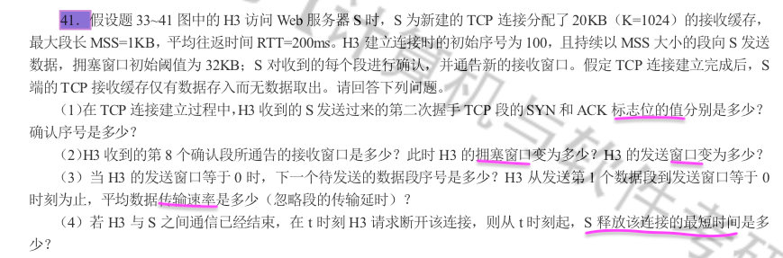
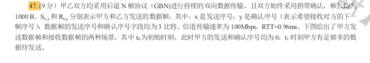
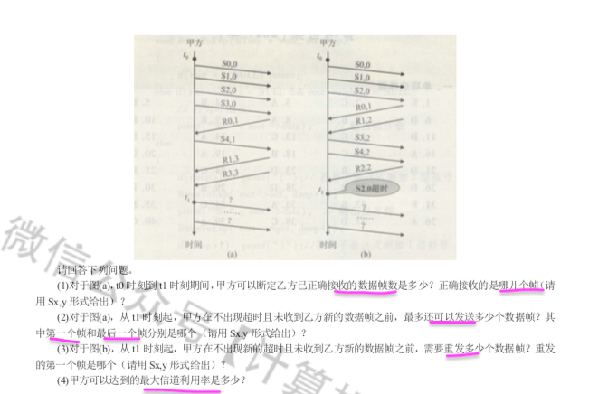

[TOC]

# 计算机网络

#  真题

## 1
- 

## 2
- 传输控制协议

## 3
  

## 4 - School
  .png)

## 5
  .png)

## 6
- .png)

## 7

.jpg)

## 8
.png)

# 应用层- HTTP

# 传输层-TCP

## :star2: 考点：

> Note ：
>
> 

 :smile: start 

---

---

### 1 产生

1. ##### 谁创造的？

    > **罗伯特·卡恩**
    >
    > ​	鲍勃·卡恩(Bob Kahn)，生于美国纽约州纽约市布鲁克林区，发明了TCP协议，并与文特·瑟夫一起发明了IP协议;这两个协议成为互联网存在基石。
    >
    > 
   >
   > 
   >
   > 
   >
   > **文特·瑟夫**,文顿·格雷·瑟
   >
   > 英语：Vinton Gray Cerf，1943年6月23日-
   >
   > ​	文特·瑟夫，是20世纪70年代创建互联网的元老之一，
   >
   > ​	1943年6月23日出生于美国洛杉矶。文特·瑟夫现任谷歌公司副总裁兼首席互联网专家。
   >
   > ​	他和罗伯特·卡恩合作设计了TCP/IP协议及互联网的基础体系结构。许多人把瑟夫看作“互联网之父”之 一。
   >
   > ​	2004年，卡恩和瑟夫因为他们在互联网协议方面所取得的杰出成就而荣膺美国计算机学会（ACM）颁发的图灵奖。
   >
   > ​	2007年年3月，瑟夫受聘为清华大学名誉教授。
   >
   > 
   >
   > 

   

2. ##### 什么时候出来的？

   1973年

   开发出来是在1973年，而真正的大面积应用是在**1983**年。

3. ##### 为什么创造？

   把两台计算机连在一起，只是迈出了建立互联网的一小步。
   
   人们很快发现，如果要把更多的不同型号的计算机，通过不同规格的网络连接在一起，还要让它们能<u>共享内容</u>，就非得发明一套更先进的技术不可。
   
   > 1. 连**接更多**的电脑
   > 2. **共享**数据

### 2 它是什么

TCP

传输控制协议TCP（TransmissionControlProtocol)

> `协议` `规则`

##### 定义

TCP是一个协议

##### <u>特征-5点</u>

1. 面向连接。 

2. 端到端。 

3. 可靠的。 

4. 全双工。 

5. 字节流。

##### <u>功能-4点</u>

1. 可靠
   1. 3次握手4次挥手-建立连接，释放连接
   2. 超时重传

   3. 停止等待
2. 流量
   1. 目的：发送方别太快，让接收方，`来得及`接。

      1. 窗口 
      2. 快慢
3. 拥塞
4. 连接
   1. 什么情况下，会出现拥塞。
   2. 控制

### 3 能干什么

##### 1. 连接

###### 建立

​	3次握手机制

###### 结束

###### 状态展示
---

# 网络层-IP

## :star2: 考点：

- 111

  

---

> Note ：
>
> IP协议

 :smile: start 

---

---

### 1 产生

1. ##### 谁创造的？

   > **罗伯特·卡恩**
   >
   > ​	鲍勃·卡恩(Bob Kahn)，生于美国纽约州纽约市布鲁克林区，发明了TCP协议，并与文特·瑟夫一起发明了IP协议;这两个协议成为互联网存在基石。
   >
   > 
   >
   > 
   >
   > 
   >
   > **文特·瑟夫**,文顿·格雷·瑟
   >
   > 英语：Vinton Gray Cerf，1943年6月23日-
   >
   > ​	文特·瑟夫，是20世纪70年代创建互联网的元老之一，
   >
   > ​	1943年6月23日出生于美国洛杉矶。文特·瑟夫现任谷歌公司副总裁兼首席互联网专家。
   >
   > ​	他和罗伯特·卡恩合作设计了TCP/IP协议及互联网的基础体系结构。许多人把瑟夫看作“互联网之父”之 一。
   >
   > ​	2004年，卡恩和瑟夫因为他们在互联网协议方面所取得的杰出成就而荣膺美国计算机学会（ACM）颁发的图灵奖。
   >
   > ​	2007年年3月，瑟夫受聘为清华大学名誉教授。
   >
   > 
   >
   > 

   

2. ##### 什么时候出来的？

   1973年

   开发出来是在1973年，而真正的大面积应用是在1983年。

3. ##### 为什么创造？

   利用IP协议就可以使这些性能各异的网络在网络层上看起来是一个统一>的网络

   > 1. 在网络层
> 2. 统一

### 2 它是什么

##### 1.IP

网际协议IP

> `协议` `规则`

##### 2.定义

IP是一个协议；

##### (1).内容

- IP协议
- 配合还有3个协议
  - Address Resolution Protocal [ARP]-地址解析协议
  - Internet Control Message Protocal[ICMP]-网际控制报文协议（监控状态）
  - Internet Group Management Protocal[IGMP] - 网际组管理控制协议

#####  (2).特征

1. 尽最大努力。 
2. 虚拟。
   - 间接交付 
   - 直接交付

##### (3).[主要功能]地址

分类

1. 分类地址
  - 2段（网段+主机）
    - 0 - 8 位
    - 10 - 16 位
    - 110 -  24
    - 1110 - 多播
    - 1111 - save
2. 子网地址
3. 超网

##### (4).[*主要功能*]格式

###### a. IPv4

- IPV4是什么？
- 
- 为什么使用它？
- 怎么使用它？
- 好处？
- 坏处？

###### b. IPv6

- ipv6产生的原因
  
- 2011年IPv4已经耗尽。
  
- IPV6是什么？

  - 更大的地址空间。128位

  - 扩展地址层次结构。

  - 灵活的首部格式。

  - 改进的选项

  - 允许协议继续扩充

  - 支持资源的预分配

    

    >更大；
    >
    >扩展；
    >
    >预分配；

    

- 为什么使用它？

  - 解决ipv4耗尽根本措施采用更大空间的新版本ipv6。

- 怎么使用它？

- 好处？

- 坏处？

###### (5).[主要功能]路由选择

1. 路由选择是什么？
   1. 从一个主机带着数据去另一个主机。
   2. 例如：美国数据来到中国。
   3. 
2. 为什么要进行路由选择？
   1. 一个主机到另一个主机，为了到达。
   2. 为了快速到达。
   3. 互联网规模非常大
   4. 机构不愿意对外暴露网络信息
   5. Autonomous system 自治系统
   6. 自治系统是：单一技术管理下的一组路由器。单一的，一致的策略。
   7. 例如，一个大的ISP就是一个大的自治系统。
   8. 内部网关协议（Interior Gateway Protocal）
      1. 在一个自治系统内，路由选择。
         1. RIP
         2. OSPF
         3. 域间路由选择
         4. 域内路由选择
   9. 外部网关协议（External Gateway Protocal）
      1. 源主机和目的主机在不同的自治系统中。
         1. BGP
         2. 自治系统之间的路由选择
3. 选择应该怎么进行
   1. 静态路由
      1. 人工配置每一条路由。
   2. 动态路由
      1. 网络实时变化，有些路由器会突然使用不了。路由需要动态变化。
4. 优点
5. 缺点

6. 主要的协议详细解释

   1. RIP-ROUTING Information Protocol

      ​	1. 基于距离向量的；路由选择协议

      2. 很少被使用
      3. 简单
      4. 不能超过15个跳数。
      5. 只能用于小型互联网。
      6. 选择最短路由
      7. 忽略高速但路由器较多的情景。
      8. 过程
         1. 和那些路由器交换信息？
            1. 只和自己相邻的人交换信息
         2. 交换什么信息
            1. 我在本自治系统所有网络的最短距离
            2. 以及到每个网络经过的下一跳的路由器
            3. 按固定时间间隔交换路由信息。
         3. 什么时候交换信息

   2. OSPF

   3. BGP-Border Gateway Protocal

   4. 路由器的构成

###### (6).VPN

1. VPN是什么？

   1. 产生的原因

      主机很多，但是IP地址很少。

      并不需要所有的主机都连接外网。

      

   2. 产生的时间

   3. 它是什么

      1. 利用公网的互联网作为本机构各专用网的载体，这样的专用网又称为虚拟专用网。

         > 本地地址：仅在内部使用，自行分配。不需要向互联网管理机构申请全球唯一的IP地址。
         >
         > 全球地址
         >
         > 专用地址：只能用于内部进行通信，不能和互联网上的主机通信。-本地地址
         >
         > ​						所有的路由器不转发专用地址的数据报。
         >
         > 专用网：全世界可能有很多重名的专用网，但不会引起麻烦，因为这些专用地址仅在内部使用。
         >
         > 二义性：内部某个主句和互联网相连接，那么这个内部本地地址，有可能和互联网中别的地址重合。
         >
         > 使用场景：跨国公司，利用公网的互联网作为本机构各专用网的载体，这样的专用网又称为虚拟专用网。

###### 3.  <u>功能4点</u>

- 
- 

### 3 能干什么

###### 1.生地址

- 

###### 2.找地址

目的：各自独立找地址。

- 解析
- 控制报文
- 管理

### 4 主能做什么

1. 地址

##### 2. 多播

  ###### （1）什么是多播？

-  1对多通信。

###### （2） 它是干什么的？

  用户使用场景：

- 实时通信。

- 实时会议

- 股市

- 视频服务

- 软件更新

- 交互式会议

- 多媒体通信

###### （3） 为什么用它？

  - 大大节约网络资源。
  - 只需发送一次。
  - 适用许多场景

    

###### （4） 使用它注意事项
- 多播地址只能用于目的地址，不能用于源地址

###### （5） 怎么使用它

- 使用它需要遵守两个协议
  - Internet Group Managenent Protocol
  - 路由选择协议

​	

